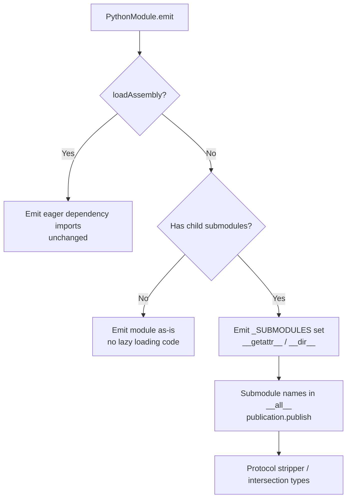

# Design Document: Python Lazy Imports

## Overview

This design replaces the eager submodule import block at the end of each generated `__init__.py` with a PEP 562 lazy loading mechanism using module-level `__getattr__` and `__dir__`. The change is scoped to the `PythonModule.emit()` method in `packages/jsii-pacmak/lib/targets/python.ts`.

Currently, every non-assembly-loading `__init__.py` ends with:

```python
# Loading modules to ensure their types are registered with the jsii runtime library
from . import submodule_a
from . import submodule_b
```

This eagerly loads every submodule at import time. For `aws-cdk-lib`, this means thousands of modules are loaded when a user writes `import aws_cdk`, even if they only need `aws_cdk.aws_s3`.

The new pattern replaces this with:

```python
import importlib as _importlib

_SUBMODULES = {
    "submodule_a",
    "submodule_b",
}

def __getattr__(name: str) -> object:
    if name in _SUBMODULES:
        mod = _importlib.import_module(f".{name}", __name__)
        globals()[name] = mod
        return mod
    raise AttributeError(f"module {__name__!r} has no attribute {name!r}")

def __dir__() -> list[str]:
    return [*__all__, *_SUBMODULES]
```

Submodules are only imported when first accessed (e.g., `aws_cdk.aws_s3`), at which point the jsii runtime type registration side effects fire as usual. Assembly-loading modules (`loadAssembly=true`) are excluded and continue to use eager imports.

## Architecture

The change is entirely within the code generation layer — no runtime changes are needed. The jsii Python runtime already supports on-demand type registration because types self-register when their containing module is imported.



### Key Design Decisions

1. **`importlib.import_module` with relative path**: We use `importlib.import_module(f".{name}", __name__)` rather than `__import__` because it mirrors the semantics of `from . import <name>` and works correctly with `pkgutil.extend_path` namespace packages in both pip and bazel environments.

2. **`globals()` caching**: After a successful import, the module is stored in `globals()` so that Python's normal attribute lookup finds it on subsequent accesses without re-entering `__getattr__`. This is the standard PEP 562 caching pattern.

3. **Assembly-loading modules excluded**: Modules with `loadAssembly=true` (the `_jsii` package) must eagerly import dependencies to initialize the jsii kernel. These are already guarded by an `assert` in `addPythonModule` and never have child submodules registered.

4. **`import importlib` added to module header**: We add `import importlib as _importlib` to the standard imports block (only when the module has submodules). The underscore-prefixed alias avoids polluting the module namespace and is hidden by `publication.publish()`.

5. **Submodule names remain in `__all__`**: This preserves `from aws_cdk import *` behavior. When Python processes `import *`, it accesses each name in `__all__`, which triggers `__getattr__` for submodule names, lazily loading them.

## Components and Interfaces

### Modified Component: `PythonModule.emit()` method

**File**: `packages/jsii-pacmak/lib/targets/python.ts`

The `emit()` method is the only method that changes. The modification replaces the final "Loading modules" block with the lazy loading code block.

#### Current flow (end of `emit()`):
1. Emit `__all__` list
2. Call `publication.publish()`
3. Emit eager `from . import <submodule>` for each child module
4. Emit protocol stripper / intersection types

#### New flow (end of `emit()`):
1. Emit `__all__` list (unchanged — submodule names still included)
2. Call `publication.publish()` (unchanged)
3. **If modules.length > 0**: Emit `_SUBMODULES` set, `__getattr__`, and `__dir__`
4. Emit protocol stripper / intersection types (unchanged)

#### New import in module header

When `this.modules.length > 0`, add to the imports block:

```typescript
code.line('import importlib as _importlib');
```

This is placed alongside the existing standard library imports (`abc`, `builtins`, `datetime`, etc.).

#### Generated lazy loading block

```python
_SUBMODULES = {
    "submodule_a",
    "submodule_b",
}

def __getattr__(name: str) -> object:
    if name in _SUBMODULES:
        mod = _importlib.import_module(f".{name}", __name__)
        globals()[name] = mod
        return mod
    raise AttributeError(f"module {__name__!r} has no attribute {name!r}")

def __dir__() -> list[str]:
    return [*__all__, *_SUBMODULES]
```

### Unchanged Components

- **`PythonModule.addPythonModule()`**: No changes. Submodule registration logic is unaffected.
- **`PythonModule.emitDependencyImports()`**: No changes. Assembly-loading modules continue to eagerly import dependencies.
- **`PythonModule.emitRequiredImports()`**: No changes. Cross-submodule type imports (used in type annotations) remain eager.
- **`type-name.ts`**: No changes. Type resolution and import path computation are unaffected.
- **`util.ts`**: No changes.
- **`publication.publish()` call**: Remains in the same position, before the lazy loading block.
- **`__all__` list**: Continues to include submodule short names.

### Interface Contract

The generated Python module's public interface is unchanged:

| Access Pattern | Before | After |
|---|---|---|
| `import aws_cdk` | Loads all submodules | Loads only root module |
| `aws_cdk.aws_s3` | Already loaded | Triggers `__getattr__` → lazy import |
| `from aws_cdk import aws_s3` | Already loaded | Triggers `__getattr__` → lazy import |
| `from aws_cdk import *` | Already loaded | Each `__all__` name triggers `__getattr__` |
| `dir(aws_cdk)` | Shows all names | `__dir__` returns `__all__` ∪ `_SUBMODULES` |
| `import aws_cdk.aws_s3` | Python resolves via `__init__.py` | Same — Python's import system handles this |

## Data Models

No new data models are introduced. The existing `PythonModule` class fields are sufficient:

- `this.modules: PythonModule[]` — already tracks child submodules
- `this.loadAssembly: boolean` — already distinguishes assembly-loading modules
- `this.pythonName: string` — used to compute relative submodule short names

The only new generated Python artifact is the `_SUBMODULES` set literal, which is a simple set of string constants derived from `this.modules`.

## Correctness Properties

*A property is a characteristic or behavior that should hold true across all valid executions of a system — essentially, a formal statement about what the system should do. Properties serve as the bridge between human-readable specifications and machine-verifiable correctness guarantees.*

### Property 1: Submodule set correctness

*For any* `PythonModule` with one or more child submodules, the generated `_SUBMODULES` set SHALL contain exactly the sorted short names of all direct child submodules, and the generated code SHALL NOT contain any eager `from . import <submodule>` statements for those submodules.

**Validates: Requirements 1.1, 8.1**

### Property 2: __all__ includes submodule names

*For any* `PythonModule` with one or more child submodules, the generated `__all__` list SHALL include the short name of every direct child submodule.

**Validates: Requirements 2.2**

### Property 3: Assembly-loading modules are excluded from lazy loading

*For any* `PythonModule` with `loadAssembly` set to true, the generated code SHALL NOT contain `_SUBMODULES`, `__getattr__`, or `__dir__` definitions, and SHALL continue to emit eager dependency imports.

**Validates: Requirements 6.1**

### Property 4: Code generation determinism (idempotence)

*For any* jsii assembly, generating Python code twice from the same assembly SHALL produce byte-for-byte identical output.

**Validates: Requirements 8.2**

## Error Handling

### AttributeError for unknown attributes

The generated `__getattr__` raises `AttributeError` with a descriptive message when the requested name is not in `_SUBMODULES`. This is the standard Python protocol for missing attributes and ensures that `hasattr()`, `getattr(mod, name, default)`, and try/except patterns work correctly.

```python
raise AttributeError(f"module {__name__!r} has no attribute {name!r}")
```

### Import errors propagate naturally

The generated `__getattr__` does NOT wrap `importlib.import_module` in a try/except. If a submodule fails to import (e.g., missing dependency, syntax error, jsii type registration failure), the original `ImportError` or other exception propagates to the caller. This matches the behavior of eager `from . import` statements and satisfies Requirement 3.3.

### No silent fallback

There is no fallback mechanism. If a submodule listed in `_SUBMODULES` cannot be imported, the error is surfaced immediately. This is intentional — silent failures would mask real problems in the generated packages.

## Testing Strategy

### Snapshot Tests (Primary validation)

The existing snapshot test infrastructure (`packages/jsii-pacmak/test/generated-code/target-python.test.ts`) is the primary validation mechanism. It generates Python code for all test fixture packages (`@scope/jsii-calc-base-of-base`, `@scope/jsii-calc-base`, `@scope/jsii-calc-lib`, `jsii-calc`) and compares against stored snapshots.

**After this change:**
- All snapshots will be updated to reflect the new lazy loading pattern
- The mypy check that runs on generated code will validate type correctness of `__getattr__` and `__dir__`
- The pyright check (`python-pyright.test.ts`) will validate type checker compatibility

### Property-Based Tests

Property-based tests will validate the correctness properties using `fast-check` (already available in the jsii monorepo's test infrastructure via Jest).

Each property test will:
- Generate random inputs (submodule name lists, module configurations)
- Invoke the code generation logic
- Assert the property holds across 100+ iterations

**Configuration:**
- Library: `fast-check`
- Minimum iterations: 100 per property
- Each test tagged with: `Feature: python-lazy-imports, Property {N}: {description}`

**Property tests to implement:**

1. **Property 1 test**: Generate random arrays of valid Python identifier strings as submodule names. Create a `PythonModule` with those submodules, run `emit()`, and verify:
   - The output contains a `_SUBMODULES` set with exactly those names, sorted
   - The output does NOT contain `from . import <name>` for any of those names

2. **Property 2 test**: Generate random arrays of submodule names. Run `emit()` and verify every submodule short name appears in the `__all__` list.

3. **Property 3 test**: Generate module configurations with `loadAssembly=true`. Run `emit()` and verify the output contains none of: `_SUBMODULES`, `def __getattr__`, `def __dir__`.

4. **Property 4 test**: For a given assembly fixture, run code generation twice and verify the outputs are identical. (This can also be validated as a simpler determinism check by running emit twice on the same PythonModule configuration.)

### Unit Tests (Example-based)

Example-based unit tests for specific scenarios:

- Module with submodules generates `__getattr__` with correct `importlib.import_module(f".{name}", __name__)` pattern
- Module with submodules generates `__dir__` returning `[*__all__, *_SUBMODULES]`
- Module with zero submodules generates no lazy loading code
- `__getattr__` raises `AttributeError` for unknown names (code structure check)
- `publication.publish()` appears before the lazy loading block
- `import importlib as _importlib` is added to imports when submodules exist
- `import importlib as _importlib` is NOT added when no submodules exist
- The `from ..._jsii import *` statement is preserved in non-assembly modules

### Integration Tests (Existing)

The existing integration test suite (compliance tests, runtime tests) validates end-to-end behavior:

- `from aws_cdk import aws_s3` works
- `import aws_cdk.aws_s3` works
- `from aws_cdk import *` loads all submodules
- jsii type registration works on first access
- Type marshaling and cross-language callbacks function correctly

These tests run against the generated packages and exercise the actual lazy loading at runtime.


## Implementation Notes

### Note 1: Dotted imports bypass `__getattr__`

`import aws_cdk.aws_s3` (the dotted form) does NOT go through `__getattr__`. Python's import system resolves subpackages directly by looking for the directory on disk. This means the dotted import pattern works without any special handling from our side. No action needed — just be aware that `__getattr__` only fires for attribute access (`aws_cdk.aws_s3`) and `from aws_cdk import aws_s3`, not for `import aws_cdk.aws_s3`.

### Note 2: Cross-module type deserialization (verify during implementation)

If a method returns a type from a module the user never explicitly imported (e.g., an `aws_s3.Bucket` method returns an `aws_iam.Role`), the jsii runtime needs to deserialize that type. Currently this works because `aws_iam` was eagerly loaded. With lazy loading, `aws_iam` might not be loaded yet.

The jsii Python runtime resolves types by FQN and should trigger imports as needed, so this is expected to work. However, add a test case during implementation that exercises this scenario: call a method that returns a type from an unimported submodule and verify it deserializes correctly.
