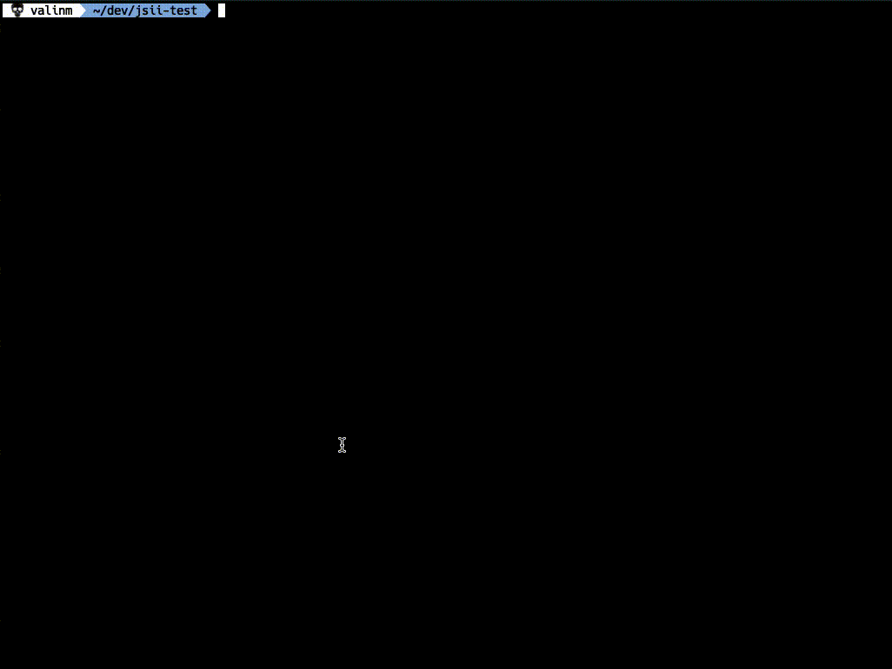

# 

jsii-config is a command line utility for configuring [jsii enabled modules](../../README.md). It is useful to help convert an existing typescript module to a jsii module. It can also be used to revise existing jsii compiler configuration optiions, such as adding a new language target.

[See the jsii documentation](https://aws.github.io/jsii/user-guides/lib-author/configuration/) for more information on how the configuration options affect jsii's output.

## Usage

jsii-config requires an existing package.json with the following fields:

- name
- version
- repository
- main
- author

For details on the content of these fields, [see the jsii documentation](https://aws.github.io/jsii/user-guides/lib-author/configuration/#additional-requirements-extensions).

jsii-config can be called via npx.

`npx jsii-config`

When called without arguments, the resulting jsii-config will be written to the package.json in the current working directory. To specify a package.json file in another location, use the `--package-json` or `-p` option.

`npx jsii-config -p ./some-dir/package.json`

jsii-config can be run with the `--dry-run` or `-d` option to print the resulting config to stdout instead of writing to package.json. This can be useful for viewing the tool's output withou changing your package.json.
